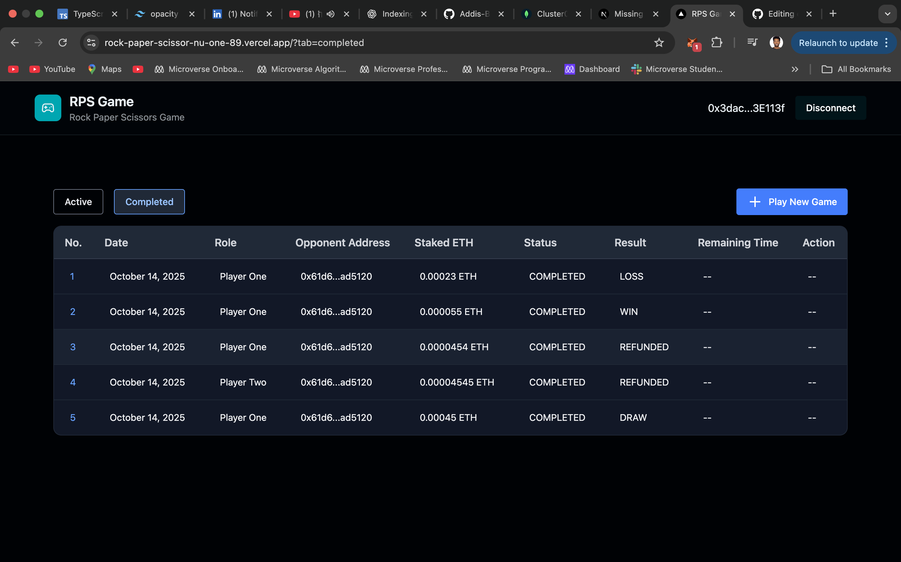
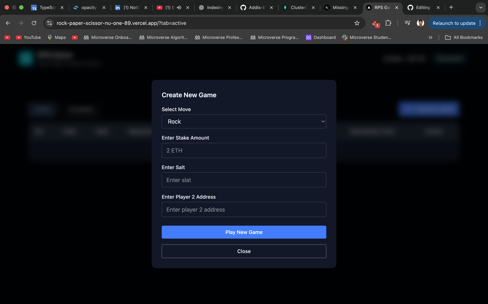

# Rock-Paper-Scissors Web3 Game

A Web3-based Rock-Paper-Scissors dApp built as part of a technical challenge. This implementation integrates with a a smart contract provided by the Kleros, focusing on secure client-side interaction, and encrypted gameplay.

- Note: The application is desktop-only.

## Project Overview

This project demonstrates:

- Secure wallet connection and signature-based authentication

- Encrypted player moves (commit–reveal logic using cryptography)

- On-chain game interaction using ethers.js v6 and TypeChain

- Real-time game updates stored in MongoDB

- Clean and modular frontend built with Next.js (App Router) and TypeScript

## How to Play

1. Connect Wallet & Sign

- Use your MetaMask wallet to connect and sign a verification message. This signature is securely used to encrypt and decrypt your move and salt before storing them in the database.

By doing this:

   - Your move and salt remain private and tamper-proof.

   - You don’t need to remember or manually store them to reveal the game later.

   - The game can be safely revealed and verified using your wallet signature.

Note:

- The application currently runs on the Sepolia test network.
When connecting, if your wallet is not on Sepolia, it will automatically switch to the Sepolia network.
If the Sepolia network is not already added to your wallet, the app will add and switch to it automatically.

2. Create Game
- Choose your move — Rock, Paper, Scissors, Lizard, or Spock — set your stake amount, and invite another player by address.

3. Wait for Opponent
- Your game will appear as active until Player 2 joins and plays their move.

4. Reveal Move
- Once both players have played, reveal your move to determine the winner.

5. Winner Gets Rewards
- The winner automatically receives the combined staked amount.

6. Timeout Rules

- If Player 2 doesn’t play within the timeout, Player 1 can refund their staked ETH.

- If Player 1 doesn’t reveal after Player 2 has played, Player 2 can claim 2× the staked amount after the timeout expires.

## Tech Stacks

| Layer                      | Technology                                        |
| -------------------------- | ------------------------------------------------- |
| **Frontend Framework**     | Next.js 14, TypeScript                            |
| **Blockchain Interaction** | Ethers.js v6, TypeChain                           |
| **Encryption**             | AES-GCM + ECDSA wallet signatures                 |
| **Database**               | MongoDB (Change Streams for updates)              |
| **Smart Contract**         | Solidity (Provided by Kleros)                     |
| **Deployment**             | Vercel, Sepolia                                   |

## Demo & Screenshots

* **Live Demo:** [Live Demo](https://rock-paper-scissor-nu-one-89.vercel.app/)

**Screenshots:**





## ⚡ Getting Started

### Prerequisites

* Node.js >= 18
* Yarn or NPM
* MongoDB Atlas CLI
* Docker

### Run the app locally

1. **Clone the repository**

```bash
git git@github.com:Addis-Belete/rock-paper-scissor.git
cd rock-paper-scissor
```

2. **Install dependencies**

```bash
yarn install
# or
npm install
```

3. **Install MongoDB Atlas CLI**

```bash
# macOS
brew install mongodb-atlas-cli
# Windows
choco install mongodb-atlas-cli
```

4. **Install Docker**

```bash
# macOS
brew install docker
# Windows
choco install docker-desktop
```

5. **Start Docker Engine**

6. **Deploy Mongo Cluster**

```bash
atlas deployments setup ethcrawler --type local \
--mdbVersion 8.0 --port 27017 --connectWith skip
```

7. **Create `.env` file** in the root:

```env
MONGODB_URI=mongodb://localhost:27017/?directConnection=true
```

8. **Run the app locally**

```bash
yarn dev
# or
npm run dev
```

The app will run at `http://localhost:3000`.

---